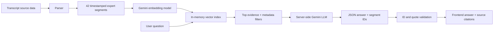

# ExpertCall AI

ExpertCall AI is a source-first research workspace for analysing three expert calls about the European robotic surgery market. It is designed for an AI Engineer case-study demo where factual grounding, exact quotations and explainable retrieval matter more than a generic chatbot experience.

## Features

- Parses the three supplied transcripts into 42 timestamped speaker segments.
- Answers all six interview-guide questions independently for France, Germany and the United Kingdom.
- Generates cross-expert agreements, disagreements and market differences from retrieved evidence.
- Supports grounded questions across all calls.
- Validates every model-selected segment ID before returning a response.
- Derives quote text, timestamp, expert, market and source from the stored transcript, never from model-generated citation text.
- Includes deterministic tests and a live evaluation script that never runs in normal unit tests.

## Architecture



The Vite React frontend calls a small native Node HTTP API in `server/index.ts`. The server owns retrieval, Gemini calls, prompt construction and citation validation. The browser never receives `GEMINI_API_KEY` and never calls Gemini directly.

Important modules:

- `src/lib/parser.ts`: parses timestamps, speakers and source metadata.
- `src/lib/embeddings.ts`: Gemini `gemini-embedding-001` adapter plus a deterministic no-key fallback for local tests.
- `src/lib/retrieval.ts`: in-memory vector index, cosine similarity, hybrid scoring and metadata filtering.
- `src/lib/llm.ts`: server-side Gemini Interactions API JSON adapter and segment-ID validation.
- `src/lib/citations.ts`: exact quote verification against original segment text.
- `server/index.ts`: `/api/guide`, `/api/analysis`, `/api/ask` and `/api/health`.

## Retrieval and cosine similarity

Each expert segment is embedded once when the API starts. A question is embedded with the same model. For vectors $a$ and $b$, cosine similarity is:

$$
\mathrm{cos}(a,b) = \frac{a \cdot b}{\|a\|\|b\|}
$$

The index ranks expert statements using 80% cosine similarity and 20% keyword overlap. Interviewer prompts are excluded from answer evidence. Searches can filter by `documentId`, expert or market. This is sufficient for 42 short segments and keeps the architecture easy to explain.

When no Gemini key is configured, deterministic hashed vectors keep the app and tests runnable offline. This fallback is clearly reported by `/api/health`; it is not presented as a substitute for production semantic embeddings.

## Grounding and citation safety

The server sends the LLM only the user question and retrieved evidence in this format:

```text
SEGMENT_ID: germany-02-4
EXPERT: Anna Keller
MARKET: Germany
TIMESTAMP: 02:08
TEXT: ...
```

The prompt requires JSON containing only an answer and copied `segmentIds`. It instructs Gemini to use no outside knowledge, return `Not found in the provided transcripts.` when evidence is insufficient, and never generate quote or timestamp text. The server then:

1. Removes unknown and duplicate segment IDs.
2. Rejects answers with no valid supporting IDs.
3. Looks up each valid ID in the parsed source store.
4. Creates citations from the original segment text and timestamp.
5. Runs exact quote verification before the response is sent to the frontend.

This prevents the model from inventing citations even if it produces malformed or unsupported output.

## Setup and run

Requires Node.js 20+.

```bash
npm install
Copy-Item .env.example .env
# Add GEMINI_API_KEY to .env for real Gemini embeddings and generation.
npm run dev:all
```

Open the Vite URL printed by the frontend process, normally `http://localhost:5173/`. The API listens on `http://localhost:8787/`.

Run the checks:

```bash
npm test
npm run build
npm run evaluate
```

`npm run evaluate` evaluates all six guide questions for all three experts. With `GEMINI_API_KEY`, it uses live Gemini embeddings and generation. Without a key, it runs the same retrieval and citation checks with deterministic embeddings and clearly labels the mode. Normal unit tests never call a paid API.

## Environment variables

Defined in `.env.example`:

- `GEMINI_API_KEY`: server-only Gemini credential. Never use a `VITE_` prefix.
- `GEMINI_MODEL`: defaults to `gemini-3.5-flash-lite`, a current stable Flash model suited to a small no-billing demo.
- `GEMINI_EMBEDDING_MODEL`: defaults to `gemini-embedding-001`.
- `API_PORT`: defaults to `8787`.

`.env` is ignored by Git and must never be committed.

## Scaling path

At 30 transcripts, the current parser and metadata contract can remain. Move ingestion and embedding into a background job, batch embedding requests, cache vectors and add document-level access filters.

At 300 transcripts, replace the in-memory index with a persistent vector store, add hybrid BM25/semantic retrieval, reranking, query/result caching, model observability and a versioned evaluation set. Keep the server-side provider and citation validation boundary unchanged.

At 3,000 transcripts, partition the index by project or tenant, process ingestion asynchronously, use a durable job queue, batch and retry embedding work, enforce access controls before retrieval, and monitor retrieval recall, citation validity, latency and cost. The frontend contract still only needs grounded JSON plus source-derived citations.

## Limitations

- The supplied transcript content currently lives in `src/data/transcripts.ts`; a production ingestion job would load uploaded documents from durable storage.
- Gemini availability, model names and API quotas are external dependencies.
- The no-key fallback is deterministic retrieval for development, not a semantic model.
- Cross-market statements describe these three interviews only and must not be generalized to entire countries or Europe.
